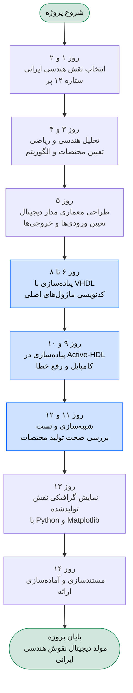

# Roadmap

```mermaid
flowchart TD
    A(["شروع پروژه"]) --> B["روز ۱ و ۲<br/>انتخاب نقش هندسی ایرانی<br/>ستاره ۱۲ پر"]
    B --> C["روز ۳ و ۴<br/>تحلیل هندسی و ریاضی<br/>تعیین مختصات و الگوریتم"]
    C --> D["روز ۵<br/>طراحی معماری مدار دیجیتال<br/>تعیین ورودی‌ها و خروجی‌ها"]
    D --> E["روز ۶ تا ۸<br/>پیاده‌سازی با VHDL<br/>کدنویسی ماژول‌های اصلی"]
    E --> F["روز ۹ و ۱۰<br/>پیاده‌سازی در Active-HDL<br/>کامپایل و رفع خطا"]
    F --> G["روز ۱۱ و ۱۲<br/>شبیه‌سازی و تست<br/>بررسی صحت تولید مختصات"]
    G --> H["روز ۱۳<br/>نمایش گرافیکی نقش تولیدشده<br/>با Python و Matplotlib"]
    H --> I["روز ۱۴<br/>مستندسازی و آماده‌سازی ارائه"]
    I --> J(["پایان پروژه<br/>مولد دیجیتال نقوش هندسی ایرانی"])

    style A fill:#d1e7dd,stroke:#198754,color:#000
    style J fill:#d1e7dd,stroke:#198754,color:#000
    style E fill:#cfe2ff,stroke:#0d6efd,color:#000
    style F fill:#cfe2ff,stroke:#0d6efd,color:#000
    style G fill:#cfe2ff,stroke:#0d6efd,color:#000
```
